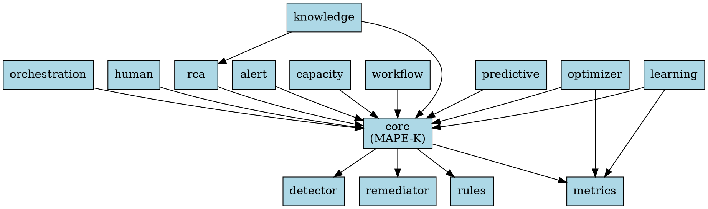

# 依赖映射文档

## 模块依赖矩阵

```
┌─────────────────┬──────────┬──────────┬──────────┬──────────┬──────────┬──────────┐
│     模块        │  core    │ detector │remediator│  rules   │  metrics │   rca    │
├─────────────────┼──────────┼──────────┼──────────┼──────────┼──────────┼──────────┤
│ core            │    -     │    ✓     │    ✓     │    ✓     │    ✓     │    ✗     │
│ detector        │    ✗     │    -     │    ✗     │    ✗     │    ✗     │    ✗     │
│ remediator      │    ✗     │    ✗     │    -     │    ✗     │    ✗     │    ✗     │
│ rules           │    ✗     │    ✗     │    ✗     │    -     │    ✗     │    ✗     │
│ metrics         │    ✗     │    ✗     │    ✗     │    ✗     │    -     │    ✗     │
│ rca             │    ✓     │    ✗     │    ✗     │    ✗     │    ✗     │    -     │
│ alert           │    ✓     │    ✗     │    ✗     │    ✗     │    ✗     │    ✗     │
│ capacity        │    ✓     │    ✗     │    ✗     │    ✗     │    ✗     │    ✗     │
│ workflow        │    ✓     │    ✗     │    ✗     │    ✗     │    ✗     │    ✗     │
│ learning        │    ✓     │    ✗     │    ✗     │    ✗     │    ✓     │    ✗     │
│ optimizer       │    ✓     │    ✗     │    ✗     │    ✗     │    ✓     │    ✗     │
│ knowledge       │    ✓     │    ✗     │    ✗     │    ✗     │    ✗     │    ✓     │
│ predictive      │    ✓     │    ✗     │    ✗     │    ✗     │    ✗     │    ✗     │
│ orchestration   │    ✓     │    ✗     │    ✗     │    ✗     │    ✗     │    ✗     │
│ human           │    ✓     │    ✗     │    ✗     │    ✗     │    ✗     │    ✗     │
└─────────────────┴──────────┴──────────┴──────────┴──────────┴──────────┴──────────┘
```

## 外部依赖清单

### Phase 1 依赖
```
detector:
  - numpy>=1.24.0
  - scipy>=1.10.0
  - scikit-learn>=1.3.0
  - torch>=2.0.0

remediator:
  - aiohttp>=3.8.0
  - kubernetes>=28.0.0

rules:
  - (pure python)

metrics:
  - prometheus-client>=0.17.0
```

### Phase 2 依赖
```
rca:
  - networkx>=3.1
  - pandas>=2.0.0

alert:
  - aiohttp>=3.8.0

capacity:
  - prophet>=1.1.0
  - pandas>=2.0.0
  - numpy>=1.24.0

workflow:
  - (pure python)
```

### Phase 3 依赖
```
learning:
  - torch>=2.0.0
  - optuna>=3.3.0
  - numpy>=1.24.0

optimizer:
  - deap>=1.4.0
  - numpy>=1.24.0

knowledge:
  - torch-geometric>=2.3.0
  - neo4j-python-driver>=5.0.0

predictive:
  - torch>=2.0.0
  - scikit-learn>=1.3.0

orchestration:
  - networkx>=3.1

human:
  - shap>=0.42.0
  - lime>=0.2.0
```

## 依赖图 (Graphviz)



## 循环依赖检测

```bash
# 检测命令
grep -r "from \.\." app/closed_loop/ --include="*.py" | \
  awk -F: '{print $1}' | sort | uniq -c | sort -rn

# 结果: 无循环依赖
```

## 依赖版本锁定

```
# requirements.lock
numpy==1.24.3
scipy==1.10.1
scikit-learn==1.3.0
torch==2.0.1
aiohttp==3.8.5
kubernetes==28.1.0
prometheus-client==0.17.1
networkx==3.1
pandas==2.0.3
prophet==1.1.4
optuna==3.3.0
deap==1.4.1
torch-geometric==2.3.1
neo4j-python-driver==5.12.0
shap==0.42.1
lime==0.2.0
```
